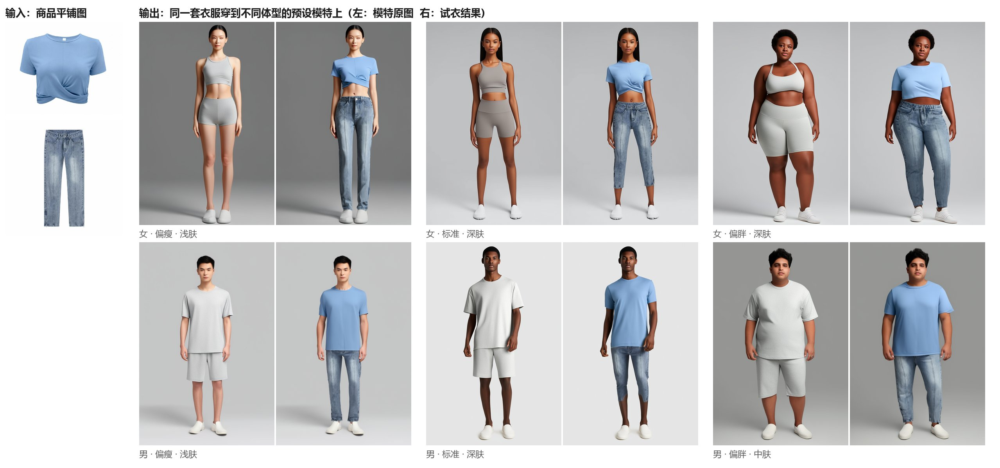
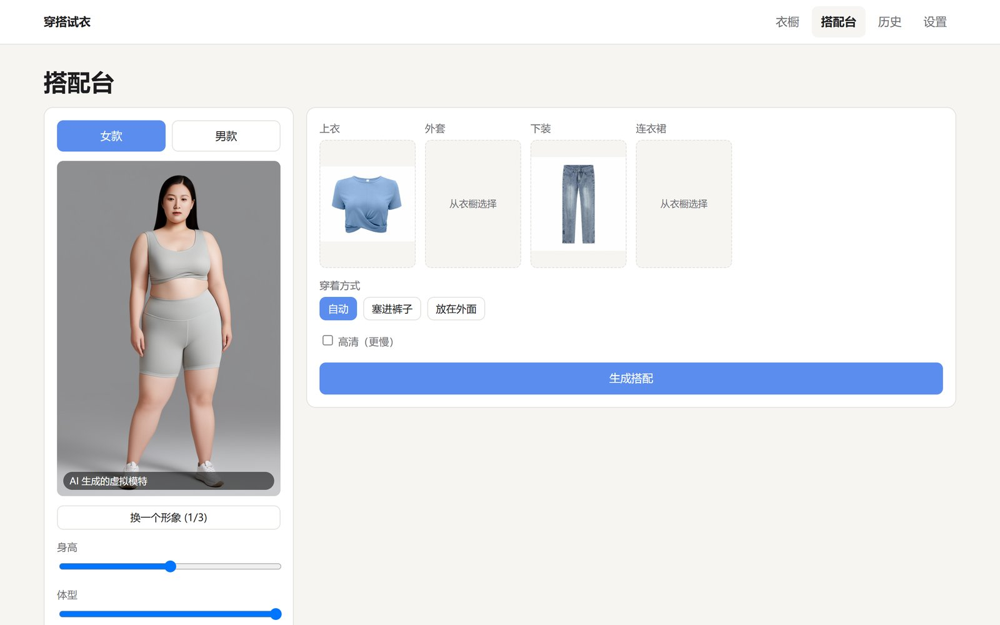
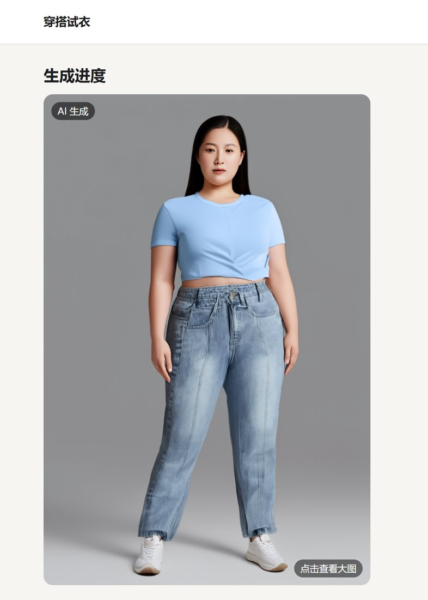
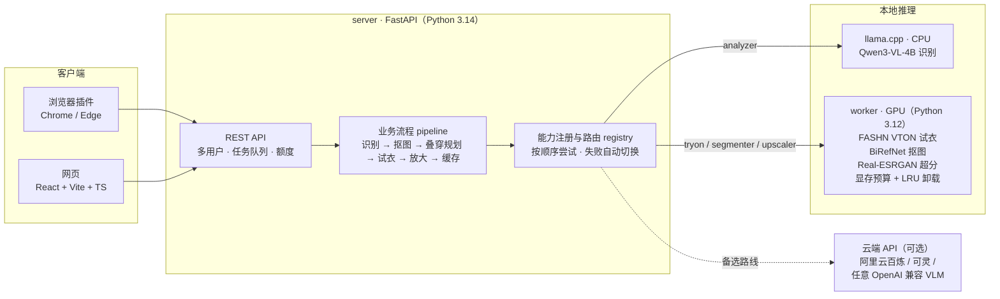

# 穿搭试衣 Outfit Try-On

> 把淘宝、京东、优衣库、Amazon 上看中的衣服，一键穿到和你体型相近的模特身上，看看这几件搭在一起到底好不好看。

**跨电商 AI 虚拟试衣 · 网页 + 浏览器插件**

[English](README.en.md) · [效果](#效果) · [功能](#功能) · [架构](#架构) · [技术亮点](#技术亮点) · [快速开始](#快速开始)



<sub>上图为真实运行结果：输入两张商品平铺图（示例图来自阿里云官方文档），输出由本地FASHN VTON v1.5 生成；模特为 AI 生成的虚拟模特。</sub>

---

## 为什么做这个

网购衣服时，上衣在 A 店、裤子在 B 店、外套在另一个平台，**每家店的模特都不一样，没法看出这几件放在一起是什么效果**，更看不出穿在自己这种身材上是什么样。

这个项目的做法：

1. **收集**：在任意电商商品页点一下浏览器插件，或者粘贴链接 / 拖入图片，衣服就进了你的"衣橱"；
2. **理解**：本地视觉大模型自动识别类别（上衣 / 外套 / 下装 / 半裙 / 连衣裙）、颜色和拍摄方式，必要时自动抠图；
3. **搭配**：选一个和自己体型接近的预设模特（性别 × 胖瘦 × 肤色，共 18 种体型、53 个形象），挑几件衣服；
4. **生成**：AI 按"先下装后上衣、外套最后"的规则分步试穿，输出正面效果图，可选超分放大。

## 效果

| 场景 | 效果 | 说明 |
|---|---|---|
| 单件平铺图（上衣 / 裤子） | ✅ 可用 | 一步约 55～60 秒（RTX 4060 Laptop） |
| 连衣裙 | ✅ 5/5 | 版型、颜色、长度都能保留 |
| 上衣 + 下装两件套 | ✅ 可用 | 18 个体型模特全部验证通过（见上图） |
| 模特上身图作为输入 | ⚠️ 2/5 | 只能去背景、抠不出单件衣服，网页上有提示 |
| 三件叠穿（T 恤 + 外套 + 裤子） | ⚠️ 实验功能 | 扩散模型会重画整片区域，层次不稳定，下一版本重点改进 |

界面截图：

| 搭配台：选体型、选衣服 | 结果页 |
|---|---|
|  |  |

## 功能

- **三种导入方式**：粘贴商品链接或分享口令文本（schema.org / Open Graph 通用解析）· 上传 / 拖入 / Ctrl+V 粘贴图片（支持 avif、heic）· Chrome / Edge 插件在商品页一键加入衣橱
- **自动识别**：类别、颜色、是平铺图还是模特上身图；识别错了可以手动改，也可以强制重新抠图
- **18 种体型预设模特**：身高、体型滑块吸附切换，同一体型有 2～3 个形象可换；所有模特都带"AI 生成的虚拟模特"标识
- **叠穿规划**：自动决定穿衣顺序，支持"塞进裤子 / 放在外面"，连衣裙与上下装冲突时自动取舍
- **任务队列**：轻任务（识别、抠图）和 GPU 任务分两条队列，显示排队位置和进度；结果按内容哈希缓存，重复搭配秒出
- **多用户内测**：邀请码登录、数据按用户隔离、每日次数上限（保护唯一的一块显卡）、反馈入口
- **中英双语、深浅色主题、手机端适配（375px）**

## 架构



**核心原则：按"能力"定义接口，模型随时可换。** 系统抽象出七种能力：

`resolver` 链接解析 · `analyzer` 服装识别 · `segmenter` 抠图 · `tryon` 试衣 · `upscaler` 超分 · `turntable` 360° 视频 · `model_generator` 生成预设模特

每种能力可以挂多个实现（本地开源模型、云端 API），在 `providers.yaml` 里用路由声明优先级：

```yaml
routes:
  tryon:    [local-gpu, aliyun-tryon]       # 本地优先，失败时自动用云端
  tryon.hd: [aliyun-tryon-plus, local-gpu]  # 高清路线
  analyzer: [qwen-local]                    # 换成豆包 / Kimi / DeepSeek 只需加一行配置
```

接入新模型 = 写一个适配器文件 + 配置里加一行，业务代码、接口、网页都不用改。

| 目录 | 内容 |
|---|---|
| [`server/outfit_core/`](server/outfit_core/) | 能力接口、数据类型、注册与路由、叠穿规划、业务流程、缓存 |
| [`server/providers/`](server/providers/) | 适配器：OpenAI 兼容 VLM、阿里云（试衣 / 分割 / 文生图 / 图生视频）、可灵、远程 worker |
| [`server/api/`](server/api/) | FastAPI 接口层：SQLite、双任务队列、用户隔离、额度 |
| [`server/bench/`](server/bench/) | 模型对比评测工具，输出 HTML 报告 |
| [`server/presets/`](server/presets/) | 预设模特库（18 体型 / 53 张，阿里云万相文生图一次性生成） |
| [`worker/`](worker/) | 本地 GPU 推理进程：GPU 锁串行、按显存预算自动加载 / 卸载模型 |
| [`web/`](web/) | 网页前端，由后端直接托管 |
| [`extension/`](extension/) | 浏览器插件（Manifest V3） |
| [`ops/`](ops/) | 一键启停、状态检查、内测访问方案 |

## 技术亮点

- **8GB 笔记本显卡跑通完整链路**：识别模型放 CPU（llama.cpp），GPU 只给试衣 / 抠图 / 超分；worker 里用全局 GPU 锁串行执行，按每个模型的 `vram_gb` 做预算，超预算时按最久未用（LRU）自动卸载。
- **识别性能与准确率**：输入图片统一缩放到长边 768，单次识别从 263 秒降到 p90 约 35 秒；配合提示词优化，类别准确率 **60% → 93%**。
- **许可证逐层核对**：代码、权重、训练数据、依赖模型分别核对（见 [`LICENSES.md`](LICENSES.md)）。FASHN 自带的人体解析器继承 NVIDIA SegFormer 的非商用许可，因此 vendor 了上游代码并**整条移除**这部分；CatVTON、IDM-VTON、OOTDiffusion 等非商用模型一律不用；配置里用 `commercial_ok` 标记，路由用到不可商用实现时启动告警。
- **安全**：网页托管路由做了路径穿越防护并有回归测试；多用户模式下所有数据按用户隔离，文件下载同样校验令牌。
- **统一接口**：网页、浏览器插件共用同一套 REST 接口，字段、状态值、错误码统一定义，以后做手机 App 可以直接复用。
- **测试**：server 端 96 个单元 / 接口测试（6 个需要真实模型的用例默认跳过），另有端到端接口回归脚本 `bench/e2e_api.py`。

## 快速开始

环境：Windows 11、NVIDIA 显卡 8GB+（只用云端 API 可以不要显卡）、Python 3.12（worker）与 3.14（server）、Node 20+。

```powershell
# 1. server
cd server
python -m venv .venv
.venv\Scripts\python -m pip install -r requirements.txt
copy .env.example .env                                   # 用云端能力时填写 DASHSCOPE_API_KEY 等
copy config\providers.example.yaml config\providers.yaml
.venv\Scripts\python -m pytest -q

# 2. worker（本地 GPU 推理；权重从 Hugging Face / GitHub 官方仓库下载，共几 GB）
cd ..\worker
py -3.12 -m venv .venv
.venv\Scripts\python -m pip install -r requirements.txt
.venv\Scripts\python scripts\download_fashn_weights.py
.venv\Scripts\python scripts\download_birefnet_weights.py
.venv\Scripts\python scripts\download_realesrgan_weights.py

# 3. 识别模型：把 llama.cpp 和 Qwen3-VL-4B GGUF 放到 worker/llama_cpp、worker/models/qwen3vl，见 worker/README.md

# 4. 网页
cd ..\web
npm install
npm run build

# 5. 一键启动三个服务，然后打开 http://127.0.0.1:8000
cd ..
powershell -ExecutionPolicy Bypass -File ops\start_all.ps1
powershell -ExecutionPolicy Bypass -File ops\status.ps1
```

只看界面不跑模型：在 `web/` 下执行 `$env:VITE_MOCK="1"; npm run dev`（PowerShell），网页会使用内置的假接口。

浏览器插件：Chrome / Edge 打开"扩展程序 → 开发者模式 → 加载已解压的扩展程序"，选择 `extension/` 目录。

## 后续计划

- 改进多件叠穿（T 恤 + 外套 + 裤子）的层次稳定性
- 360° 转盘展示
- 手机 App（复用同一套接口）

## 许可证

本项目代码以 [Apache-2.0](LICENSE) 开源。所用模型与第三方组件的许可证见 [`LICENSES.md`](LICENSES.md)；其中 `worker/app/vendor/fashn_vton/` 来自 [FASHN VTON](https://github.com/fashn-AI/fashn-vton-1.5)（Apache-2.0），已移除非商用的人体解析部分，详见该目录下的 NOTICE。

- 预设模特图由阿里云百炼万相文生图生成，均为 **AI 生成的虚拟模特**，不对应任何真实人物；
- README 效果图中的衣服示例图来自阿里云官方文档的公开示例，仅用于演示；
- 试衣结果为 AI 合成图像，对外传播时请标注"AI 生成"。
